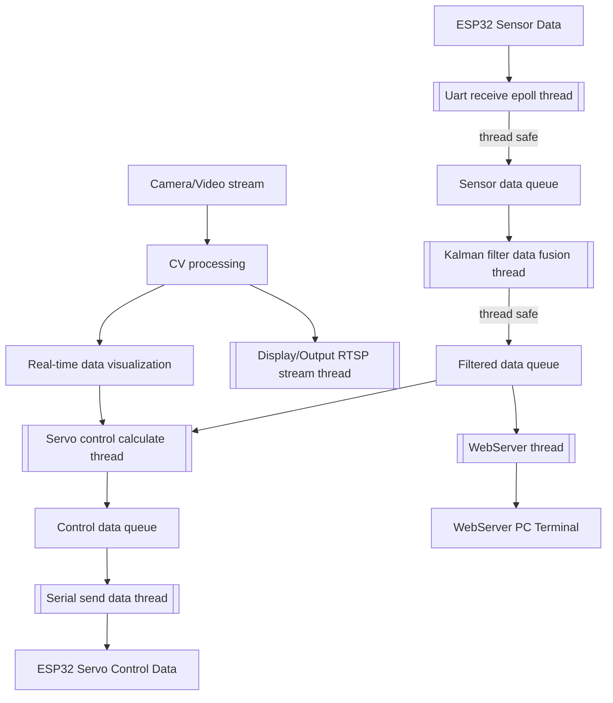

# Piny_dart Project based on MaixCDK

# 1. Project Introduction

# 2. Thread Introduction

1. Uart receive epoll thread:
2. Kalman filter data fusion thread:
3. Display/Output RTSP stream thread:
4. Servo control calculate thread:
5. Serial send data thread:
6. WebServer thread:
7. Real-time data visualization(CV):
